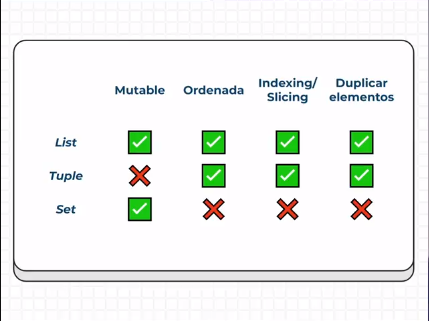

# Curso_de_Python_Comprehensions_Funciones_y_Manejo_de_Errores

**Nuevo Curso de Comprehension Lists, Funciones y Manejo de Errores**

<p align="center"></p>

# Table of Content 

- [Sets](#sets)
- [Modificando Conjuntos](#modificando-conjuntos)
- [Operaciones de Conjuntos](#operaciones-de-conjuntos)
- [List Comprehension](#list-comprehension)
- [Dictionary comprehension](#dictionary-comprehension)
- [Dictionary Comprehension: Condition](#dictionary-comprehension-condition)
- [Lists vs. Tuples vs. Sets](#lists-vs-tuples-vs-sets)

# Sets

Denominados conjuntos, las propiedades alrededor de los conjuntos es que

* Se pueden modificar.
* No tienen un orden.
* No permiten duplicados, por lo tanto, estos conjuntos sacan términos únicos y si se repiten simplemente
no los imprime o los toma en cuenta. 

# Modificando Conjuntos 

Los conjuntos se pueden manejar como listas o Strings, es decir, se pueden modificar sus elementos, medir 
su tamaño, adicionar elementos, en fin 

```Python
set_countries = {'col','mex','bol'}     #Definimos el conjunto

size = len(set_countries)               #Tamaño del conjunto
print(size)

print('col' in set_countries)           #Verificar si 'col' está en set_countries, imprime True, porque se cumple la conidición 
print('pe' in set_countries)            #Verifica si 'pe' está en set_countries, imprime False, debido a que no cumple la condición

#add
set_countries.add('pe')                 #El método .add adiciona un nuevo elemento 
print(set_countries)

# update 
set_countries.update({'arg','ecu'})     #Agrega los elementos de un conjunto al conjunto anterior
print(set_countries)

# remove 
set_countries.remove('col')             #El método remove borra el elemento col 
print(set_countries)

set_countries.discard('Ven')            # Con este método se puede borrar elementos, si el elemento no existe
print(set_countries)                    #simplemente no lo borra. 

set_countries.clear()                   #Borra todos los elementos dentro del conjunto 
print(set_countries)

```
# Operaciones de Conjuntos 

Existen diferentes operaciones dentro del entorno de conjuntos, como unión, intesección, diferencia y diferencia simétrica

```Python
set_a = {'col','mex','bol'}         #Tenemos dos conjuntos
set_b = {'pe','bol'}

#union
set_c = set_a.union(set_b)          #Este método une los elementos del conjunto a con el conjunto b
print(set_c)
print(set_a | set_b)                #El operador "|" cumple la función de unir los conjuntos 

#intersección
set_c = set_a.intersection(set_b)   #Este método toma los elementos comúnes entre ambos conjuntos
print(set_c)
print(set_a & set_b)                #El operador "&" cumple la función de intersección

#diferencia
set_c = set_a.difference(set_b)     #Este método quita los elementos de b presentes en a
print(set_c)
print(set_a - set_b)                #El operador "-" indica diferencia 

#Diferencia simétrica 
set_c = set_a.symmetric_difference(set_b)   #Este método hace una unión sin los elementos que coinciden en común
print(set_c)
print(set_a ^ set_b)                #El operador "^" permite hacer la diferencia simétrica
```

# List Comprehension

[element for element in iterable]

En la sintáxis tenemos elemento y el ciclo donde se extraen elementos de cualquier iterable

```Python
numbers = []

for element in range(1,11):
    numbers.append(element*2)
    
print(numbers)

numbers_v2 = [element*2 for element in range(1,11)] #Por cada elemento del iterable se está agregando un 
print(numbers_v2)                                   #elemento a la lista
```

[element for element in iterable if condition]

En este caso tenemos el elemento, ciclo donde se extraen elementos de cualquier iterable y la condición opcional para filtrar elementos 

```Python
numbers = []

for i in range(1,11):
    if i%2 == 0:
        numbers.append(i*2)

print(numbers)

numbers_v2 = [i*2 for i in range(1,11) if i%2 == 0]
print(numbers_v2)
```

# Dictionary Comprehension

Al igual que las listas, tenemos una sintáxis similar, por ejemplo:

{key:value for var in iterable}

Elemento llave:valor y el Ciclo donde se extrarn elementos de cualquier iterable 

# Dictionary Comprehension: Condition 

{key:value for var in iterable if condition}

Elemento llave:valor, el Ciclo donde se extrarn elementos de cualquier iterable y condición opcional para filtrar elementos. 

# Lists vs. Tuples vs. Sets

<p align="center"></p>

# Funciones

Las funciones son estructuras de código para poder reutilizar las líneas ya escritas 

```Python
def my_print(text):
    print(text*2)

def suma(a,b):
    return print(a+b)

my_print('Este es mi texto ')
my_print('Hola ')

suma(14,12)
suma(20,22)
```

# funciones con Return 
```Python
def sum_with_range(min,max):
    print(min, max)
    sum = 0
    for x in range(min,max):
        sum += x

    return sum

result = sum_with_range(1,10)
print(result)
result_2 = sum_with_range(20,30)
print(result_2)
result_3 = sum_with_range(result,result_2)
print(result_3)
```

# Parametros por defecto y múltiples return 

Retornar más de un valor y ver a profundidad los argumentos 

```Python
def find_volume(length = 1,width = 1,depth = 1):
    return length*width*depth, width, 'hola'

result,width,string = find_volume(width = 10)
print(result)
print(width)
print(string)
```

# El Scope

Se crea para definir el alcance que tiene una variable para poder trabajar con ella, para entender mejor dentro de una función puede haber variables, las cuales se llaman **variables locales**.Estas variables locales, se identifican porque están escritas dentro de la definición de la función y únicamente funcionan mientras que la función sea llamada o utlizada. si vas allamar a una variable local por fuera de la función, noservirá, existen **variables globales**, que son las que están escritas fuera de la función. Estas variables si funcionan al ser llamadas sin la función, porque no están determinadas dentro de la función. 

```Python
price = 100

def increment():
    # price = price + 10    #Genera un error de asignación 
    price = 200
    price = price +10
    print(price)
    return price

print(price)
price_2 = increment()
print(price_2)
```

# Refactor Game

```Python
import random

def choose_options():
    
    options = ('piedra', 'papel', 'tijera')

    user_option = input('piedra, papel o tijera => ')
    user_option = user_option.lower()

    if not user_option in options:
      print('esa opcion no es valida')
      #continue
      return None, None

    computer_option = random.choice(options)

    print('User option =>', user_option)
    print('Computer option =>', computer_option)

    return user_option, computer_option

def check_rules(user_option, computer_option, user_wins, computer_wins):

    if user_option == computer_option:
        print('Empate!')
    elif user_option == 'piedra':
        if computer_option == 'tijera':
            print('piedra gana a tijera')
            print('user gano!')
            user_wins += 1
        else:
            print('Papel gana a piedra')
            print('computer gano!')
            computer_wins += 1
    elif user_option == 'papel':
        if computer_option == 'piedra':
            print('papel gana a piedra')
            print('user gano')
            user_wins += 1
        else:
            print('tijera gana a papel')
            print('computer gano!')
            computer_wins += 1
    elif user_option == 'tijera':
        if computer_option == 'papel':
            print('tijera gana a papel')
            print('user gano!')
            user_wins += 1
        else:
            print('piedra gana a tijera')
            print('computer gano!')
            computer_wins += 1

    return user_wins, computer_wins

def run_game():
    rounds = 1
    computer_wins = 0
    user_wins = 0

    while True:

        print('*' * 10)
        print('ROUND', rounds)
        print('*' * 10)

        print('computer_wins', computer_wins)
        print('user_wins', user_wins)
        
        rounds += 1

        user_option, computer_option = choose_options()
        user_wins, computer_wins = check_rules(user_option, computer_option, user_wins, computer_wins)

        
        if computer_wins == 2:
            print('El ganador es la computadora')
            break

        if user_wins == 2:
            print('El ganador es el usuario')
            break

run_game()
```

# Funciones Anónimas: Lambda

Son funciones especiales e interesantes puesto que permiten versatilidad a la hora de declarar y manejar ciertas sintaxis para las funciones. 

```Python
def increment(x):
    return x+1

# Para transformar en una lambda function se reconocen los parametros de entrada
# y los parámetros de salida, en este caso input = x y output = x+1

increment_v2 = lambda x : x+1
full_name = lambda name, last_name : str(name) + " " + str(last_name)

def run():
    result = increment(10)
    print(result)

    result = increment_v2(20)
    print(result)

    print(full_name("Mario","Riascos"))

if __name__ == '__main__':
    run()
```

# High Order Function: Una Función dentro de otra función

A una función se le puede enviar otra función y ejecutarla dentro de la primer función 

```Python
def increment(x):
    return x+1


def high_order_function(x, func):                       #Se envia unicamente el nombre de la func sin parámetros
    return x + func(x)                                  #En el return se ejecuta la fución

increment_v2 = lambda x : x+1

high_order_function_v2 = lambda x, func : x + func(x)   #La entrada es el nombre de la funcion sin parámetros
                                                        #En la salida se ejecuta la función

def run():
    print(high_order_function(20, increment))
    print(high_order_function_v2(20,increment_v2))


if __name__ == '__main__':
    run()

```

# Map 

Su fución principal es hacer transformaciones a una lista dada de elementos, estas funciones normalmente se iteran bajo las listas 

**Sintáxis**

map(function, iterables)

```Python
def second_function():
    numbers = [1,2,3,4]
    numbers_2 = [5,6,7]

    print(numbers)
    print(numbers_2)
    result = list(map(lambda x,y:x+y,numbers,numbers_2))
    print(result)

def run():
    numbers = [1,2,3,4]
    numbers_v2 = []
    numbers_v3 = list(map(lambda i : i*2,numbers))  #La función map unicamente devuelve un iterable, por lo
                                                    #tanto, se debe transformarlo a una lista. map cumple con
    for i in numbers:                               #high order function, por lo cual también recibe funciones
        numbers_v2.append(i*2)

    print(numbers)
    print(numbers_v2)
    print(numbers_v3)

if __name__ == '__main__':
    run()
    second_function()
```
# Map con Diccionarios

```Python
def add_taxes(item):
    item['taxes'] = item['price']*.19
    return item

def run():
    
    items  = [
        {
            'producto':'shirt',
            'price':100,
        },
        {
            'product':'pants',
            'price':300
        },
        {
            'product':'shoes',
            'price':200
        }
    ]

    prices = list(map(lambda item: item['price'],items))
    print(prices)

    new_items = list(map(add_taxes,items))
    print(new_items)


if __name__ == '__main__':
    run()
```

# Map con inmutabilidad 

```Python 
def add_taxes(item):
    new_item = item.copy()                      #Se crea una nueva lista, para evitar los cambios en memoria
    new_item['taxes'] = new_item['price']*.19
    return new_item

def run():
    
    items  = [
        {
            'producto':'shirt',
            'price':100,
        },
        {
            'product':'pants',
            'price':300
        },
        {
            'product':'shoes',
            'price':200
        }
    ]

    new_items = list(map(add_taxes,items))
    print('New List')
    print(new_items)
    print('Old List')
    print(items)


if __name__ == '__main__':
    run()
```

# Filter 

Sirve para filtrar elementos de una lista para que pertenezcan a una nueva lista. Ejemplo, tenemos una nueva lista de comida, se aplica un filtro, por lo tanto será un condicional que diga si es saludable o no.

```Python
numbers = [1,2,3,4,5]

new_numbers = list(filter(lambda x: x%2 == 0, numbers))  #Siempre se valida el valor True
print(new_numbers)
```

# Reduce

Tomar una lista y reducirlo a un solo valor, por ejemplo, tenemos una lista de números y queremos sumar todos esos números, por lo tanto se reduce a un solo valor, o también verificar cual es el mayor o menor 

```Python
from functools import reduce

def accum(counter,item):
    print('Counter=>',counter)
    print('Item=>',item)

    return counter + item

numbers = [1,2,3,4]

result = reduce(lambda counter, item : counter+item,numbers)    #La primer variable incrementará el valor y la segunda
                                                                #que es el ítem que se va a estar iterando
print(result)

result2 = reduce(accum,numbers)
print(result2)
```

# Módulos 

Permiten modularizar la aplicación y encerrar cierta parte de la aplicación y de la lógica en diferentes archivos. Un módulo en python directamente puede ser una archivo

```Python
import sys                  #Preguntar el sistema operativo 
print(sys.path)

import re                   #Expresiones regulares 
text = 'Mi número de telefono es 311 123 1211, el código del país es 57, mi número de la suerte es el 17' 
result = re.findall('[0-9]+',text)        
print(result)

import time                 #Manejo de fechas
timestamp = time.time()
print(timestamp)
local = time.localtime()
result = time.asctime()
print(result)

import collections          #Utilidad para manejar listas 
numbers = [1,1,2,1,2,1,4,5,3,3,21] 
counter = collections.Counter(numbers)
print(counter)              #Saber la frecuencia en la que aparece cada número 
```

# Modulos propios 

Un módulo es cualquier archivo con terminación <<.py>>, dentro de un módulo se pueden definir clases, funciones o variables

# Módulos como Scripts: __name__ y __main__

Los módulos se pueden correr de dos maneras, una es declarando las funciones dentro de ese módulo y se los pueden correr de forma directa como Scripts, sin embrago esta dualidad puede generar errores o conflictos 

# Paquetes

Un paquete es una arpeta que contiene varios módulos. 


